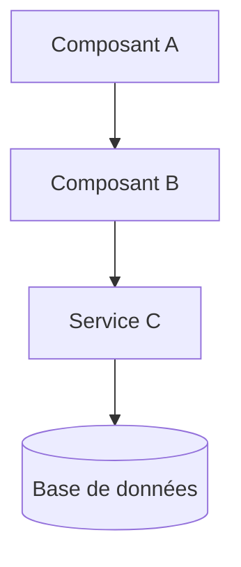
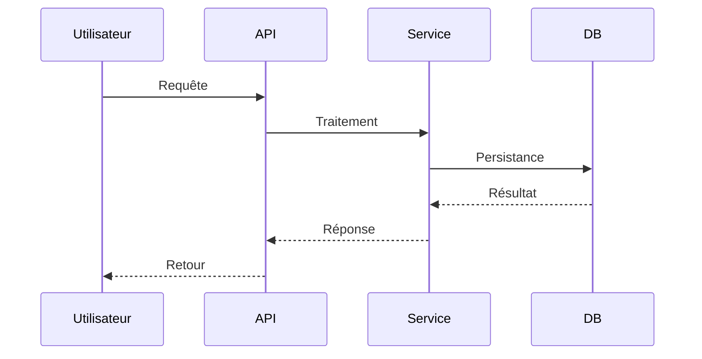

# Phase 5 : Documentation

## RÈGLES :

- ✅ TOUJOURS ajouter des docstrings/JSDoc aux fonctions modifiées/créées
- ✅ TOUJOURS mettre à jour les docs existantes si pertinentes
- ✅ En budget `high` : créer un markdown dédié avec schémas Mermaid
- 🛑 JAMAIS sur-documenter — être concis et utile

## ALLOCATION MODÈLE :

<critical>
Consulter `budget-profiles.md` :
- low : Haiku — docstrings basiques uniquement
- mid : Sonnet effort faible — docstrings + mise à jour docs existantes
- high : Sonnet effort moyen — docstrings + markdown dédié + schémas Mermaid
</critical>

## RESTAURATION CONTEXTE (mode resume) :

<critical>
Si chargé via resume :
1. Lire `{output_dir}/00-context.md` → flags, budget
2. Lire `{output_dir}/03-execute.md` → ce qui a été implémenté
</critical>

---

## SÉQUENCE :

### 1. Init save (si save_mode)

```bash
bash {skill_dir}/scripts/update-progress.sh "{task_id}" "05" "document" "in_progress"
```

### 2. Identifier les cibles de documentation

Depuis les résultats de phase 3 (exécution) :
- Lister les fonctions/classes créées ou modifiées
- Identifier les fichiers de doc existants (README, docs/, CHANGELOG)
- Vérifier si un fichier de doc est déjà lié à la feature

### 3. Docstrings / JSDoc (TOUS les budgets)

**Lancer un sous-agent doc-writer** selon le budget :

**Budget `low` (model: haiku) :**
```
Ajouter des docstrings/JSDoc basiques aux fonctions suivantes :
{liste des fonctions créées/modifiées avec chemins}
Format : une ligne de description + @param + @returns
Ne PAS ajouter de commentaires inline.
```

**Budget `mid` (model: sonnet, effort: faible) :**
```
Ajouter des docstrings/JSDoc aux fonctions suivantes :
{liste des fonctions avec chemins}
Format : description + @param + @returns + @throws + @example si utile
Ne PAS ajouter de commentaires inline superflus.
```

**Budget `high` (model: sonnet, effort: moyen) :**
```
Ajouter des docstrings/JSDoc complets aux fonctions suivantes :
{liste des fonctions avec chemins}
Format : description + @param + @returns + @throws + @example + @see
Inclure des exemples d'utilisation pertinents.
```

### 4. Mise à jour des docs existantes (mid et high)

**Si `{budget}` = `low` :** sauter au step 6

Vérifier et mettre à jour :
- README.md : section pertinente si la feature impacte l'API publique
- CHANGELOG.md : ajouter une entrée si le fichier existe
- Docs existantes : mettre à jour les sections touchées par les changements

### 5. Markdown dédié + Mermaid (high uniquement)

**Si `{budget}` != `high` :** sauter au step 6

Créer un fichier markdown dédié à la feature :

```markdown
# {feature_name}

## Vue d'ensemble

{Description en 2-3 phrases}

## Architecture



## API

### `functionName(param: Type): ReturnType`

{Description, paramètres, retour, exemples}

## Flux de données



## Configuration

{Paramètres, variables d'environnement si applicable}

## Tests

{Comment tester, commandes, couverture}
```

Placer le fichier dans le dossier de documentation du projet (docs/, README section, ou à côté du code).

### 6. Résumé de documentation

```
**Documentation terminée**

**Docstrings ajoutées :** {count} fonctions
**Docs mises à jour :** {liste des fichiers ou "aucun"}
**Markdown créé :** {chemin ou "non (budget != high)"}
**Schémas Mermaid :** {count ou "non"}
```

### 7. Save output (si save_mode)

Append à `{output_dir}/05-document.md`.

---

## NEXT STEP :

<critical>
PAS de session boundary — enchaîner vers finish ou terminer.
</critical>

```
→ Si {branch_mode} = true, committer :
  git add -u && git diff --cached --quiet || git commit -m "forge({task_id}): phase 05 - document"

→ Si save_mode = true :
  bash {skill_dir}/scripts/update-progress.sh "{task_id}" "05" "document" "complete"

→ SI {pr_mode} = true :
  Charger ./step-06-finish.md

→ SINON :
  Afficher le résumé final du workflow :
  """
  ═══════════════════════════════════════
    FORGE TERMINÉ : {task_description}
  ═══════════════════════════════════════
    Budget : {budget}
    Phases complétées : 5/5
    Fichiers modifiés : {count}
    Tests : ✓/✗
    Documentation : ✓
  ═══════════════════════════════════════
  """
```
