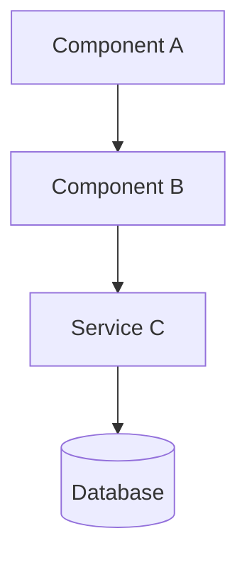
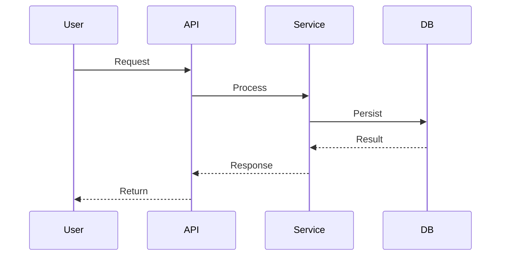

# Phase 5: Document

## RULES:

- ✅ ALWAYS add docstrings/JSDoc to modified/created functions
- ✅ ALWAYS update existing docs if relevant
- ✅ In budget `high`: create dedicated markdown with Mermaid diagrams
- 🛑 NEVER over-document — be concise and useful

## MODEL ALLOCATION:

<critical>
Consult `budget-profiles.md`:
- low: Haiku — basic docstrings only
- mid: Sonnet low effort — docstrings + update existing docs
- high: Sonnet medium effort — docstrings + dedicated markdown + Mermaid diagrams
</critical>

## CONTEXT RESTORATION (resume mode):

<critical>
If loaded via resume:
1. Read `{output_dir}/00-context.md` → flags, budget
2. Read `{output_dir}/03-execute.md` → what was implemented
</critical>

---

## SEQUENCE:

### 1. Init Save (if save_mode)

```bash
bash {skill_dir}/scripts/update-progress.sh "{task_id}" "05" "document" "in_progress"
```

### 2. Identify Documentation Targets

From phase 3 (execute) results:
- List functions/classes created or modified
- Identify existing doc files (README, docs/, CHANGELOG)
- Check if a doc file already relates to the feature

### 3. Docstrings / JSDoc (ALL budgets)

**Launch a doc-writer sub-agent** based on budget:

**Budget `low` (model: haiku):**
```
Add basic docstrings/JSDoc to the following functions:
{list of created/modified functions with paths}
Format: one-line description + @param + @returns
Do NOT add inline comments.
```

**Budget `mid` (model: sonnet, effort: low):**
```
Add docstrings/JSDoc to the following functions:
{list of functions with paths}
Format: description + @param + @returns + @throws + @example if useful
Do NOT add unnecessary inline comments.
```

**Budget `high` (model: sonnet, effort: medium):**
```
Add comprehensive docstrings/JSDoc to the following functions:
{list of functions with paths}
Format: description + @param + @returns + @throws + @example + @see
Include relevant usage examples.
```

### 4. Update Existing Docs (mid and high)

**If `{budget}` = `low`:** skip to step 6

Check and update:
- README.md: relevant section if the feature impacts the public API
- CHANGELOG.md: add entry if the file exists
- Existing docs: update sections affected by changes

### 5. Dedicated Markdown + Mermaid (high only)

**If `{budget}` != `high`:** skip to step 6

Create a dedicated markdown file for the feature:

```markdown
# {feature_name}

## Overview

{2-3 sentence description}

## Architecture



## API

### `functionName(param: Type): ReturnType`

{Description, parameters, return, examples}

## Data Flow



## Configuration

{Parameters, environment variables if applicable}

## Testing

{How to test, commands, coverage}
```

Place the file in the project's documentation folder (docs/, README section, or alongside the code).

### 6. Documentation Summary

```
**Documentation Complete**

**Docstrings added:** {count} functions
**Docs updated:** {file list or "none"}
**Markdown created:** {path or "no (budget != high)"}
**Mermaid diagrams:** {count or "no"}
```

### 7. Save Output (if save_mode)

Append to `{output_dir}/05-document.md`.

---

## NEXT STEP:

<critical>
NO session boundary — chain to finish or terminate.
</critical>

```
→ If {branch_mode} = true, commit:
  git add -u && git diff --cached --quiet || git commit -m "forge({task_id}): phase 05 - document"

→ If save_mode = true:
  bash {skill_dir}/scripts/update-progress.sh "{task_id}" "05" "document" "complete"

→ IF {pr_mode} = true:
  Load ./step-06-finish.md

→ OTHERWISE:
  Display final workflow summary:
  """
  ═══════════════════════════════════════
    FORGE COMPLETE: {task_description}
  ═══════════════════════════════════════
    Budget: {budget}
    Phases completed: 5/5
    Files modified: {count}
    Tests: ✓/✗
    Documentation: ✓
  ═══════════════════════════════════════
  """
```
